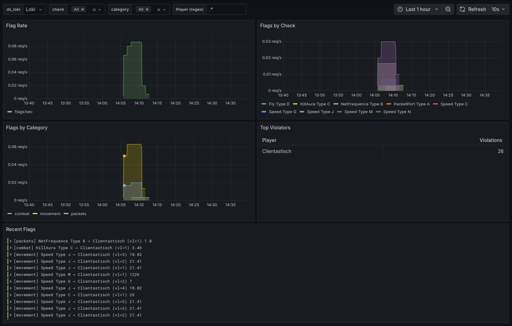

Cardinal can be used with loki.
There is an official, simple docker compose you can spin up to create a fully configured grafana instance with a pre-build dashboard.

```bash
git clone git@github.com:cardinalanticheat/grafana-loki.git
cd grafana-loki
docker compose up -d
```

After deploying the docker compose infrastructure, head over to Cardinal config and enable Loki:

```yaml
Loki:
    enabled: true # <-- Change this to true
    url: "http://localhost:3100" 
```

For a local environment, you do not need to touch the url endpoint.

The credentials are `admin` for username and password.
You can reach the grafana dashboard under [http://localhost:3002/](http://localhost:3002/d/cardinal-flags/cardinal-anticheat-flags-overview)

{ style="width: 100%; border-radius: 10px; filter: drop-shadow(0 0 0.45rem black);" }

You can use the top bar to filter for checks, player names and categories.
This will allow you to find blatant cheaters and - depending on the configured retention time - understand appeals.
